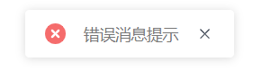

## td-message

**一款基于jQuery封装的轻量消息提示插件**




### How to use it?

---

**配置项：**

| 属性      | 说明                                           | 值类型  | 可选值                                                       |
| --------- | ---------------------------------------------- | ------- | ------------------------------------------------------------ |
| type      | 消息类型，默认为info                           | string  | info/success/warning/error                                   |
| text      | 消息文字                                       | string  | 无                                                           |
| duration  | 经过多少毫秒后关闭消息提示，默认为2000ms，即2s，如果配置为0，则表示不关闭提示 | number  | 无                                                           |
| positon   | 消息提示的位置，默认为top-center               | string  | top-left/top-center/top-right/bottom-left/bottom-center/bottom-right |
| showClose | 是否显示关闭按钮，默认开启                     | boolean | true/false                                                   |

**基本示例：**

```html
<!DOCTYPE html>
<html lang="en">
  <head>
    <meta charset="UTF-8" />
    <meta name="viewport" content="width=device-width, initial-scale=1.0" />
    <title>Document</title>
     <!-- 引入td-message.css-->
    <link rel="stylesheet" href="./td-msessage.css" />
  </head>
  <body>
    <button id="btn">弹出</button>
    <!-- 引入jQuery -->
    <script src="https://cdn.staticfile.org/jquery/1.12.4/jquery.min.js"></script>
    <!-- 引入td-message.js-->
    <script src="./td-message.min.js"></script>
    <script>
      $("#btn").click(function () {
        $.message({
          type: "error",
          text: "错误消息提示",
          duration: 2500,
          positon: "top-center",
          showClose: true
        });
      });
    </script>
  </body>
</html>
```

`Verison 0.1`
